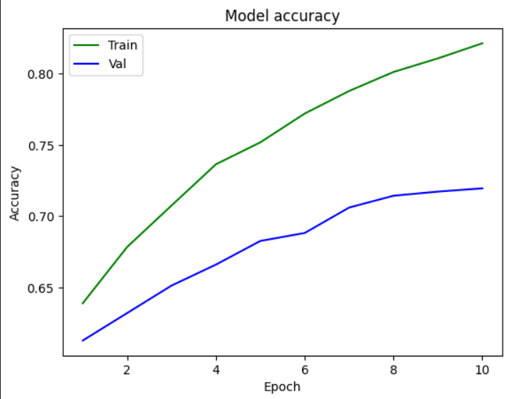

# Handwritten Text Recognition

This project is focused on building a robust system for recognizing handwritten text using advanced machine learning techniques. The goal is to convert handwritten notes into digital text accurately and efficiently.

---
## Table of Contents

- [Features](#features)
- [Dataset](#dataset)
- [Model Architecture](#model-architecture)
- [UI Deployment](#ui-deployment)
- [Results](#results)
- [Applications](#applications)
---

## Features

- **Handwritten Text Recognition:** Converts scanned handwritten documents into editable digital text.
- **Pretrained Models:** Uses state-of-the-art models for text recognition.
- **Customizable Training:** Allows users to fine-tune the model with their own datasets.
- **Web Interface:** A user-friendly interface for deploying and using the recognition tool.

---

## Dataset

- **Dataset Requirements:** High-quality scanned images of handwritten text.
- **Preprocessing:** Ensure images are grayscale and have consistent dimensions.
- For more details, see Data Pre-processing section in provided notebook.

---

## Model Architecture

The recognition system is based on a Convolutional Neural Network (CNN) combined with a Recurrent Neural Network (RNN) and Connectionist Temporal Classification (CTC) loss.

- **CNN:** Extracts features from the input images.
- **RNN:** Processes the sequential nature of text.
- **CTC Loss:** Aligns input and output sequences without requiring character-level labels.

---

## UI Deployment

The project includes a web-based interface to interact with the recognition system:

---
## Results

---

## Applications

This model has versatile applications, including:

- **E-learning:** Facilitating the digitization of handwritten lecture notes and assignments.
- **Medical Track:** Assisting in reading and digitizing handwritten prescriptions, improving accuracy and accessibility.

